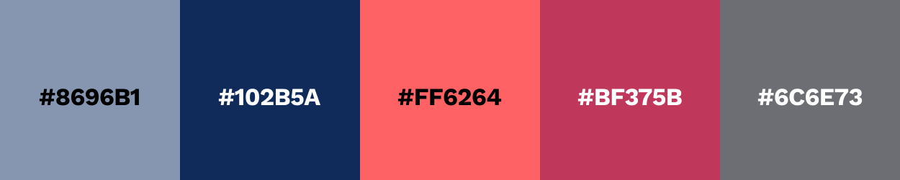
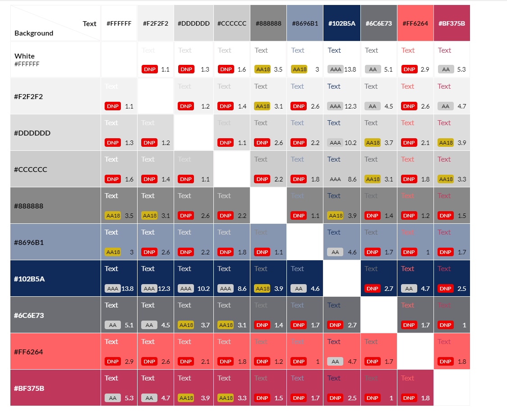

# Candy Gift - Portfolio Project 1

[Live webpage]()


## Table of Content

1. [Project Goals](#project-goals)
   + [User Goals](#user-goals)
   + [Site Owner Goals](#site-owner-goals)
2. [User Experience (UX)](#user-experience)
3. [Design](#design)
   + [Color scheme](#color-scheme)
   + [Wireframes](#wireframes)
4. [Features](#features)
5. [Technologies Used](#technologies-used)
   + [Languages](#languages)
   + [Frameworks & Tools](#frameworks-&-tools)
6. [Fixed Bugs](#fixed-bugs)
7. [Testing](#testing)
8. [Lighthouse](#kighthouse)
9. [Credits](#credits)


## Project goals


The purpose of this project is to create an imitation of the website of a private gift shop for a person who is passionate about creating gift candy bouquets.

This static website was created as part of the first project of the Code Institute to showcase HTML and CSS skills.


### User Goals

* as a website visitor I want to know what this site is about
* as a visitor I want to find an idea for gift
* as a visitor I want to get an impression of candy bouquets
* as a visitor I want easily to find the location and owner contact and possibly connect with her via social media


### Site Owner Goals

As a site owner, she wants as follows:
* Promote the handmade gifts and the happiness they provide
* Increase in the number of clients
* Provide information to the clients about types of Candy Bouquets
* website allow displaying her handmade items and allows interested person to contact her.


## User Experience (UX)


* A simple and intuitive navigation system
* Links  that work as expected
* Good information presentation and a visually appealing design 
* An easy way to contact the owner


## Design


### Color scheme


The color scheme I developed based on the original image of the logo using [AdobeColor](https://color.adobe.com/create/image).
Afterwards I used [Coolors](https://coolors.co/) to select a matching pallete. 
Also in the final project, some shades of colors from the palette can be used.




To see what  generated color pallete matches best I used  eightshapes.com to generate an accesibility table.




### Wireframes


## Features


 
## Technologies Used


### Languages


Languages used in this project:
+ HTML5
+ CSS3


### Frameworks & Tools


 + Balsamiq 
 + Adobe Color
 + EighShapes
 + Tinypng
 + Gitpod 
 + Github 
 + Google Fonts 
 + Font Awesome 


## Fixed Bugs


Form field validation was not performed when the "Submit Message" button was clicked.
After researching, I found that form validation works when using the HTMLButtonElement (represents the ```<button>``` element). Source: [MDN Web Docs](#https://developer.mozilla.org/en-US/docs/Learn/Forms/Form_validation).

To fix this, I replaced the button link tag 

```<div class="btn-submit"><a href="#.html">Send Message!</a></div>```

with the input tag button as shown below.

```<input class="btn-submit" type="submit" value="Send Message!"> ```


## Testing  


## Lighthouse


## Credits  

+ Stackoverflow 
+ MDN Web docs
+ W3Schools
 
The part of code for social  contacts  the Footer is borrowed from the Love Running project.


### Media  

Photos taken with the permission of the owner from personal accounts in Instagram and Facebook.

Hero image for Home page taken from Pixabay.
