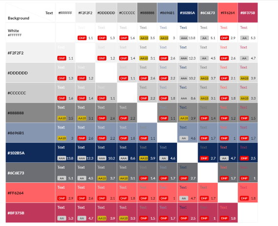
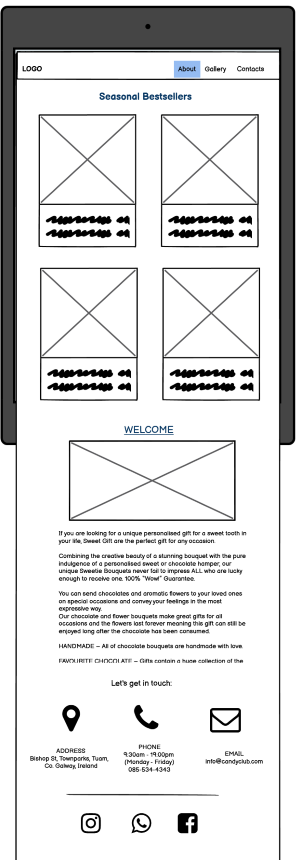
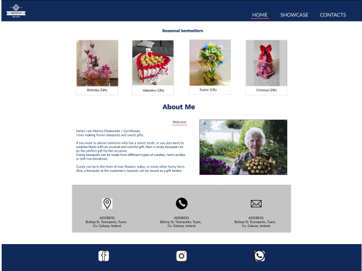
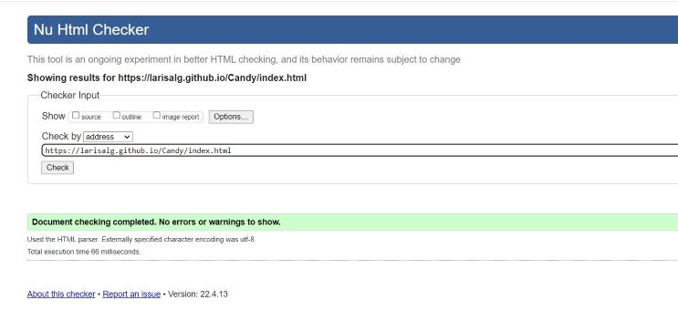
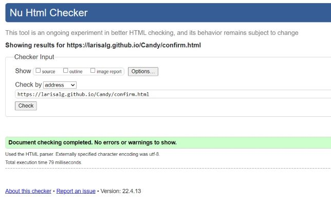

# Candy Gift - Portfolio Project 1


 


## Live Project

[View the live website on GitHub Pages](https://larisalg.github.io/Candy/index.html)

## Table of Contents

1. [Project Goals](#project-goals)
   + [User Goals](#user-goals)
   + [Site Owner Goals](#site-owner-goals)
2. [User Experience (UX)](#user-experience)
3. [Design](#design)
   + [Color scheme](#color-scheme)
   + [Wireframes](#wireframes)
4. [Features](#features)
5. [Technologies Used](#technologies-used)
   + [Languages](#languages)
   + [Frameworks & Tools](#frameworks-&-tools)
6. [Fixed Bugs](#fixed-bugs)
7. [Testing](#testing)
   + [HTML Validation](#HTML-validation)
   + [CSS Validation](#CSS-validation)
   + [Performance](#performance)
8. [Credits](#credits)
9. [Deployment](#deployment)


## Project goals


The purpose of this project is to create an imitation of the website of a private gift shop for a person who is passionate about creating gift candy bouquets.

This static website was created as part of the first project of the Code Institute to showcase HTML and CSS skills.


### User Goals

* as a website visitor I want to know what this site is about
* as a visitor I want to find an idea for gift
* as a visitor I want to get an impression of candy bouquets
* as a visitor I want easily to find the location and owner contact and possibly connect with her via social media


### Site Owner Goals

As a site owner, she wants as follows:
* Promote the handmade gifts and the happiness they provide
* Increase in the number of clients
* Provide information to the clients about types of Candy Bouquets
* website allow displaying her handmade items and allows interested person to contact her.

[Back to top](#table-of-contents)

## User Experience (UX)


* A simple and intuitive navigation system
* Links  that work as expected
* Good information presentation and a visually appealing design 
* An easy way to contact the owner

[Back to top](#table-of-contents)

## Design

### Color scheme

The color scheme I developed based on the original image of the logo using [AdobeColor](https://color.adobe.com/create/image).
Afterwards I used [Coolors](https://coolors.co/) to select a matching pallete. 
Also in the final project, some shades of colors from the palette can be used.


To see what  generated color pallete matches best I used  eightshapes.com to generate an accesibility table.




### Wireframes

I used Balsamiq to create wireframes to organize the structure of the site.

<details><summary>Wireframe version for desktop</summary>


</details>

<details><summary>Wireframe version for tablets</summary>


</details>

<details><summary>Wireframe version for mobile devices</summary>

 
</details>
<br>

After that I moved into Figma to test the colour scheme.
As the content of the first section "Seasonal Bestsellers" of the Home page is very similar to the content of the "Showcase" page, I skipped this step to avoid a repetition.
The final site due to responsiveness may differ from wireframes.

<details><summary>Home page colour mockup for desktop</summary>


</details>

<details><summary>Contacts page colour mockup for desktop</summary>


</details>

<details><summary>Home page colour mockup for mobile devices</summary>


</details>

<details><summary>Contacts page colour mockup for mobile devices</summary>


</details>
<br>


[Back to top](#table-of-contents)

## Features

### Common features

The logo and navigation bar are present on all pages.
The navigation bar contains links to the logo, Home page, Showcase, and Contacts.
The current page in the navigation menu is underlined and highlights the link on hover.
The navigation bar is fully responsive, for smaller screens the bar format changes to a column orientation with the logo at the top center of the page and the header links vertically aligned at the bottom.


**Header**

Each page has a header with a logo and a menu.
The navigation contains links to the Home page, Showcase, and Contacts.
The current page in the navigation menu is underlined and highlights the link on hover.
For smaller screens, the panel format changes to a column orientation next to the logo.


**Section Let's get in touch**

There is also a section above the footer on all pages that lists the address, opening time, phone number, and email address of the website owner.
Flexbox was used to place the content inside the section.

**Footer**

Available on the bottom of each page.
The Footer contains social media links (Facebook, Whats Up and Instagram) with 
the purpose  to provide easy access for the User to the different social media.
Clicking on the Icons takes the user to the external website in a new window.


**Home page**

At the top of the Homepage, to attract the visitor's attention, samples of work are presented in the Seasonal Bestsellers section.
Below is section "About me", which allows you to get a little idea about the owner of the site and what she does. Next to the short brief there is also an image of the Hero, corresponding to the theme of the site.

**Showcase page**

The Showcase page plays the role of a gallery and product catalog where the user can view samples of work and select a product to order.


**Contact Page**

The contact form is another way to contact the site owner.
The contact form can be filled out and submitted by users to place an order or describe their preferences.  The user is asked for his name, phone number, e-mail address, selected product number and the content of his message.

**Confirmation page**

Confirmation Page is hidden and does not have direct links to go to it. This page appears after the user completes and submits the form.
The page displays a message to the user that his message has been received and he will be redirected to the Home page.


[Back to top](#table-of-contents)


## Technologies Used


### Languages

Languages used in this project:
+ HTML5
+ CSS3


### Frameworks & Tools

 + Balsamiq 
 + Adobe Color
 + EighShapes
 + Tinypng
 + Gitpod 
 + Github 
 + Google Fonts 
 + Font Awesome 

[Back to top](#table-of-contents)

## Fixed Bugs

Form field validation was not performed when the "Submit Message" button was clicked.
After researching, I found that form validation works when using the HTMLButtonElement (represents the ```<button>``` element). Source: [MDN Web Docs](#https://developer.mozilla.org/en-US/docs/Learn/Forms/Form_validation).

To fix this, I replaced the button link tag 

```<div class="btn-submit"><a href="#.html">Send Message!</a></div>```

with the input tag button as shown below.

```<input class="btn-submit" type="submit" value="Send Message!"> ```

[Back to top](#table-of-contents)


## Testing  

### HTML Validation

The W3C Markup Validation Service was used to validate the HTML of the website.
During validating the Confirmation page, a warning about missing headers was received.
Fixed by replacing ``<section>`` tag with ``<div>`` tag.
After fixes all pages passed the test successfully without errors and without warnings.
Screenshots of page validation are attached below.

<details><summary>Home page</summary>


</details>
<details><summary>Showcase page</summary>


</details>
<details><summary>Contacts page</summary>


</details>
<details><summary>Confirm page</summary>


</details>


### CSS Validation

The website [CSS style](http://jigsaw.w3.org/css-validator/validator?lang=en&profile=css3svg&uri=+https%3A%2F%2Flarisalg.github.io%2FCandy%2Findex.html+&usermedium=all&vextwarning=&warning=1)  has successfully passed the W3C CSS Jigsaw Validation Service.  


### Performance

To test the performance and availability of the deployed site, a Lighthouse report was generated using Google Chrome Dev Tools in incognito mode for desktop version and mobile version.

<details><summary>Desktop version</summary>


</details>
<details><summary>Mobile version</summary>


</details>


[Back to top](#table-of-contents)


## Credits  

+ Stackoverflow 
+ MDN Web docs
+ W3Schools
+ Slack community
 
The part of code for social  contacts  the Footer is borrowed from the Love Running project.


### Media  

All presented photos on the site are photos of works made by my friend from her personal Instagram and Facebook accounts and used with her permission.
Hero image for Home page taken from Pixabay.


[Back to top](#table-of-contents)


## Deployment

The site was deployed to GitHub pages using the following procedure:


Go to the settings tab in Github.


Scroll down and find the Github Pages option in settings. And select a main branch or any other branch that you would like to publish and host online.


Click "Save" button and wait for a while...


The page will update and show: "Your site is ready to be published at ``https://username.github.io/repository-name/``


### Making a Local Clone
1. Log in to GitHub and locate the GitHub Repository
2. Under the repository name choose button "Code",  click "Clone or download".
3. To clone the repository using HTTPS, under "Clone with HTTPS", copy the link.
4. Open Git Bash.
Change the current working directory to the location where you want the cloned directory to be made.
5. Type *git clone*, and then paste the URL you copied in Step 3.

``> git clone https://github.com/YOUR-USERNAME/YOUR-REPOSITORY``

Press Enter. 

Your local clone will be created.

For more information follow this [link](https://docs.github.com/en/repositories/creating-and-managing-repositories/cloning-a-repository#cloning-a-repository-to-github-desktop).


[Back to top](#table-of-contents)